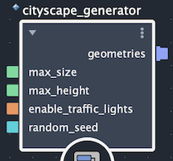

# BifrostUsd Dynamic File Format Plugin

## Overview

The *BifrostUsd DynamicFileFormat* is a Dynamic File Format plugin for OpenUSD that allows users to create USD scene data procedurally using Bifrost Graphs. In combination with the Open USD Payload system, that allows for the generation of scene data dynamically within the context of a prim.

The combination of Dynamic File Format and Payload is called Dynamic Payload in OpenUSD.

 - [Dynamic File Format](https://openusd.org/dev/api/_usd__page__dynamic_file_format.html)
 - [Payload](https://openusd.org/dev/api/class_usd_payloads.html)


## Key Features

A Bifrost Graph or Compound can be used as a Dynamic Payload to generate a USD layer procedurally.
The graph receives arguments from the Dynamic File Format plugin, including the compound name, inputs, outputs, settings and global variables, and produces a USD layer. You can use Bifrost USD nodes to directly create prims and attributes, or use non-USD Bifrost graphs (for example, geometry graphs), which are automatically translated into USD. This approach enables an infinite variety of dynamic assets that can be instantiated in a USD stage. Because the result is a standard USD layer, users can apply normal USD workflows to override or extend the generated data.


## Table of Contents

- [Simple Example](#simple-example)
- [The Compound Library](#the-compound-library)
- [The Layer identifier](#the-layer-identifier)
- [The Metadata](#the-metadata)
  - [Compound Name Metadata](#compound-name-metadata)
  - [Compound Inputs Metadata](#compound-inputs-metadata)
  - [Compound Outputs Metadata](#compound-outputs-metadata)
  - [Bifrost Settings Metadata](#bifrost-settings-metadata)
  - [Bifrost Globals Metadata](#bifrost-globals-metadata)
- [The Attributes](#the-attributes)
  - [Compound Name Attribute](#compound-name-attribute)
  - [Compound Input Attributes](#compound-input-attributes)
  - [Compound Output Attributes](#compound-output-attributes)
  - [Bifrost Settings Attributes](#bifrost-settings-attributes)
  - [Bifrost Globals Attributes](#bifrost-globals-attributes)
- [Complete example of a USD file using the Bifrost Dynamic Payload](#complete-example-of-a-usd-file-using-the-bifrost-dynamic-payload)
- [Terminal Output Ports](#terminal-output-ports)
- [The Requirements](#the-requirements)


### Simple Example

This simple example shows a USD file that uses the Bifrost Dynamic Payload to generate a mesh cube:

```{code-block} usda
#usda 1.0
def "Cube" (
    payload = @anon:autodesk:bifrost.bifrostDynamicFile@
)
{
    string bifrost:compound:name = "Modeling::Primitive::create_mesh_cube"
    token bifrost:out:cube_mesh = ""
}
```

### The Compound Library

Since the BifrostUsd Dynamic Payload can run outside of Maya, you need to set the `BIFROST_LIB_CONFIG_FILES` environment variable to specify the path to one or several config files that contains the list of published compounds. Those config files are used by Bifrost to create its library of compounds from the USD runtime.

> **Warning:**  Compounds installed in your Bifrost user directory (the default location when published from Maya) will not be found by BifrostUsd Dynamic Payload! You must publish to a shared library (also called compound pack). For more info: [Set up additional compound and graph locations](https://help.autodesk.com/view/BIFROST/ENU/?guid=Bifrost_Common_build_a_graph_create_and_edit_compounds_set_up_additional_compound_locations_html).


> **Note:** It is important to understand that even within Maya, the Bifrost plugin for Maya and the BifrostUsd Dynamic Payload plugin for USD do not share the same library. That means that if you make a compound editable in the Bifrost Graph Editor inside Maya, then modify and re-publish, the BifrostUsd library will not see the change (even if the compound is published in a location that can found using the `BIFROST_LIB_CONFIG_FILES` environment variable). You will need to reload the library by clicking on the *Reload Library* checkbox in the Maya Attribute Editor of the selected USD prim payloading a *bifrostDynamicFile*. Also if you change the inputs or outputs names and types of the published compound, you will need to update the USD file accordingly first.


### The Layer identifier

The Bifrost Dynamic File Format is used when a prim payloads a layer with the extension `.bifrostDynamicFile`

usda example:
```{code-block} usda
# The default identifier used in our tests and in Maya for the Bifrost USD Payload.
def "Root" (
    payload = @anon:autodesk:bifrost.bifrostDynamicFile@
    ...
)

# An other valid identifier for a project using the Bifrost USD Payload.
def "MyProceduralAsset" (
    payload = @anon:projectName:shotName.bifrostDynamicFile@
    ...
)
```
> **Note:**  Only `anon` and `.bifrostDynamicFile` can't be renamed.
The two sections `autodesk:bifrost` must exist, but you can change their content if you want.

### The Metadata

It is handy to set the default settings like the compound to use, the verbosity level, etc on an other prim that is referenced by the Dynamic Payload prim. This way, several Dynamic Payload prims can share the same default settings. Then you can add overrides and/or add more granular controls per Dynamic Payload prim.


#### Compound Name Metadata

`bifrostCompound.name`: Specify the fully qualified name of a published Bifrost Graph or Compound in the `name` entry of the `bifrostCompound` dictionary.

usda example:
```{code-block} usda
def "ProceduralCity" (
    prepend payload = @anon:autodesk:bifrost.bifrostDynamicFile@
    prepend references = <DynamicFileFormatField>
) ...

def "DynamicFileFormatField" (
    bifrostCompound = {
        string name = "Modeling::Primitives::cityscape_generator"
    }
)
```

#### Compound Inputs Metadata

`bifrostInputs`: Add an entry in the `bifrostInputs` with a name and type matching input(s) of name and type of the compound.


For example, this compound has two inputs: `random_seed` of type `int` and `enable_traffic_lights` of type `bool`.




We can set those inputs in the `bifrostInputs` dictionary like this:

usda example:
```{code-block} usda
def "DynamicFileFormatField" (
    bifrostInputs = {
        int random_seed = 0
        bool enable_traffic_lights = false
    }
)
```

#### Compound Outputs Metadata

`bifrostOutputs`: Add an entry in the `bifrostOutputs` with a name matching output name of the compound.
The name must be added to an array since a Bifrost compound can have more than one output. Note that in this version of the BifrostUsd Dynamic Payload, only the first output is used, subsequent entries are accepted but generate a warning (limitation).

Supported types for an output port are:

- `Object` (Bifrost mesh, strands, points or instances but not volume).
- `array<Object>`
- `BifrostUsd::Stage` (the stage must have a default prim).


usda example:
```{code-block} usda
def "DynamicFileFormatField" (

    bifrostOutputs = ["geometries"]
)
```

In addition to the regular output ports, compounds using Terminals are supported. See [Terminal Output Ports](#terminal-output-ports) section below for more details.

#### Bifrost Settings Metadata

`bifrostSettings`: A dictionary storing following settings:
  - `verbosityLevel`: You can set it to "Silent", "ErrorsOnly", "ErrorsAndWarnings" or "AllMessages".
  - `reloadLibrary`: Should always be set to false in the file. Then the application loading the USD stage can
    change it to true to reload the library and set it to false immediately after to avoid unnecessary reloads.

usda example:
```{code-block} usda
def "DynamicFileFormatField" (
    bifrostSettings = {
        bool reloadLibrary = false
        string verbosityLevel = "ErrorsOnly"
    }
)
```

#### Bifrost Globals Metadata

`bifrostGlobals`: A dictionary storing Bifrost global variables:
  - `bifrostGlobals.timeline_info_start_frame`: Set the value of the timeline_info_start_frame global variable in Bifrost. When this key is present, `timeline_info_end_frame` must also be present, and vice versa.
  - `bifrostGlobals.timeline_info_end_frame`: Set the value of the `timeline_info_end_frame` global variable in Bifrost. When this key is present, `timeline_info_start_frame` must also be present, and vice versa. When both are set, the Bifrost graph is executed once per frame in the [startFrame, endFrame] range.
  - `bifrostGlobals.time_fps`: Used to set the time in Bifrost (time = frame / fps). Only relevant when both `timeline_info_start_frame` and `timeline_info_end_frame` are present. When omitted, a default FPS value is used.

### The Attributes

You can control the BifrostUsd Dynamic Payload entirely using attributes instead of metadata.
If a metadata exists with the same name as an attribute, the attribute will override the metadata. This way you can set default values in the metadata and then override them on specific prims using attributes.
Attributes are generally more convenient as in DCCs supporting USD they are usually easy to edit. For example in Maya, the attributes of a BifrostUsd Dynamic Payload will be grouped under an Inputs group in the Bifrost group of the Attribute Editor.

#### Compound Name Attribute

`bifrost:compound:name` : Used to specify the fully qualified compound name.

usda example:
```{code-block} usda
def "ProceduralCity" (
    prepend payload = @anon:autodesk:bifrost.bifrostDynamicFile@
)
{
    string bifrost:compound:name = "Modeling::Primitives::cityscape_generator"
}
```

#### Compound Input Attributes

`bifrost:in:<name>` : Used to control a compound or graph input of same type and name.

usda example:
```{code-block} usda
def "ProceduralCity" (
    prepend payload = @anon:autodesk:bifrost.bifrostDynamicFile@
)
{
    int bifrost:in:random_seed = 345
    bool bifrost:in:enable_traffic_lights = true
}
```

#### Compound Output Attributes

`bifrost:out:<name>` : Used to specify the compound or graph output.

> **Note:** Only the first output port argument (in sorted order) is evaluated. Additional `bifrost:out:` attributes are accepted but generate a warning. The output port type must be `token`, matching the `bifrostOutputs` field type.

usda example:
```{code-block} usda
def "ProceduralCity" (
    prepend payload = @anon:autodesk:bifrost.bifrostDynamicFile@
)
{
    token bifrost:out:geometries = ""
}
```

#### Bifrost Settings Attributes

`bifrost:setting:<name>` : Used to specify the Bifrost settings.

usda example:
```{code-block} usda
def "ProceduralCity" (
    prepend payload = @anon:autodesk:bifrost.bifrostDynamicFile@
)
{
    string bifrost:setting:verbosityLevel = "AllMessages"
    bool bifrost:setting:reloadLibrary = false
}
```

#### Bifrost Globals Attributes

`bifrost:global:<name>` : Used to specify a Bifrost global variable.

usda example:
```{code-block} usda
def "ProceduralCity" (
    prepend payload = @anon:autodesk:bifrost.bifrostDynamicFile@
)
{
    double bifrost:global:timeline_info_start_frame = 1001
    double bifrost:global:timeline_info_end_frame = 1100
}
```

### Complete example of a USD file using the Bifrost Dynamic Payload

```{code-block} usda
#usda 1.0
(
    defaultPrim = "World"
)

def Xform "World" (
    kind = "assembly"
)
{
    def Xform "ProceduralCity"
    {
        def "cityscape_generator_graph" (
            kind = "component"
            prepend payload = @anon:autodesk:bifrost.bifrostDynamicFile@
            prepend references = </World/ProceduralCity/DynamicFileFormatField>
        )
        {
            # Compound inputs
            float bifrost:in:max_size = 20000
            float bifrost:in:max_height = 90
            int bifrost:in:random_seed = 345
            bool bifrost:in:enable_traffic_lights = true

            # Bifrost settings
            bool bifrost:setting:reloadLibrary = false
            string bifrost:setting:verbosityLevel = "AllMessages"

            # Bifrost global variables
            double bifrost:global:timeline_info_start_frame = 1001
            double bifrost:global:timeline_info_end_frame = 1100
        }

        def "DynamicFileFormatField" (

            # Bifrost compound name
            bifrostCompound = {
                string name = "Modeling::Primitives::cityscape_generator"
            }

            # Bifrost settings (defaults; overridden by attributes on the payload prim)
            bifrostSettings = {
                string verbosityLevel = "ErrorsOnly"
            }

            # Bifrost inputs (defaults; overridden by attributes on the payload prim)
            bifrostInputs = {
                int random_seed = 0
                bool enable_traffic_lights = false
            }

            # Bifrost outputs
            bifrostOutputs = ["geometries"]
        )
        {
        }
    }
}
```

### Terminal Output Ports

In addition to the regular output port mechanism, the BifrostUsd Dynamic Payload supports terminal output ports that can be enabled on the Bifrost Graph:
- `final`: Produces the primary render representation of the scene. The result is assigned the render imageable purpose.
- `proxy`: Produces a lightweight proxy representation. The result is assigned the proxy imageable purpose.
- `diagnostic`: Produces a debug or diagnostic representation. The result is assigned the guide imageable purpose.

When one or more terminal ports are enabled, their results are composed into the generated layer alongside any regular output port result. Terminal ports do not require a `bifrostOutputs` field or any `bifrost:out:<name>` attribute. If neither a regular output port nor any terminal port produces a valid result, the payload fails to load.

## The Requirements

This plugin must be compiled with the same USD libraries used in your application.
Since it is a USD plugin, it is found and described using a **plugInfo.json** file. The path to this **plugInfo.json** file must be added to the `PXR_PLUGINPATH` environment variable to be found by USD.
